# DRL Algorithms

## DQN (deep Q network)

## Policiy_Gradient

策略梯度是强化学习的一类方法，大致的原理是使用神经网络构造一个策略网络，输入是状态，输出为动作的概率，在这些动作里采样选择一个动作去与环境交互，这样可以起到**Exploration 和 Exploitation的tradeoff**。与环境交互后获得一个收益，根据设计的损失函数和收益使用梯度上升法更新网络参数。输出的直接是策略$\pi(a|s)$，以概率的形式呈现，且$\sum_{a} \pi(a \mid s)=1$。

### 目标函数：

这里的目标函数是指在该策略下所取得的（状态，动作）价值函数期望。

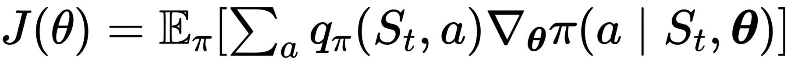

为了使这个目标函数最大化，需要做Gradient Ascent，即求出梯度，

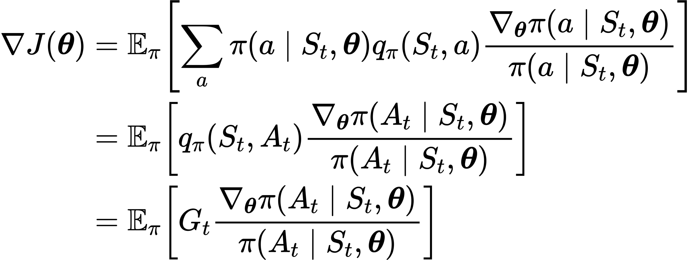

### REINFORCE

根据以上对目标函数的推导，提出REINFORCE，一种Monte-Carlo policy gradient算法，依赖于用Monte-Carlo估计的return来更新参数![[公式]](https://www.zhihu.com/equation?tex=%5Ctheta)。

REINFORCE可以work是因为sample gradient的期望和真实的gradient一样。

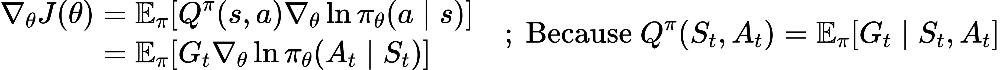

我们可以通过采样的轨迹来获得![[公式]](https://www.zhihu.com/equation?tex=G_t)（即discounted reward的和，可见前面的变量定义表)。由于一次更新需要一个完整的trajectory，REINFORCE被称为Monte-Carlo方法。

REINFORCE里的梯度更新公式：

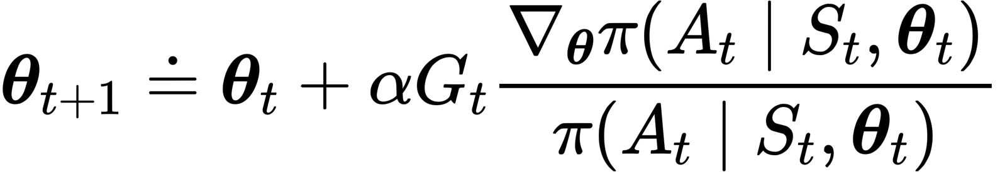

伪代码如下：


#### 实现

首先了解最重要的损失函数是怎么求的，在pytoch库中，描述了核心代码实现：

> In practice we would sample an action from the output of a network, apply this action in an environment, and then use `log_prob` to construct an equivalent loss function. Note that we use a negative because optimizers use gradient descent, whilst the rule above assumes gradient ascent. With a categorical policy, the code for implementing REINFORCE would be as follows:
>
> ```python
> probs = policy_network(state)
> # Note that this is equivalent to what used to be called multinomial
> m = Categorical(probs)
> action = m.sample()
> next_state, reward = env.step(action)
> loss = -m.log_prob(action) * reward
> loss.backward()
> 
> ```
>

这里的$log\_prob(action)$相当于求出来$\frac{\nabla_{\theta} \pi\left(A_{t} \mid S_{t}, \theta_{t}\right)}{\pi\left(A_{t} \mid S_{t}, \theta_{t}\right)}$。在一般的REINFORCE实现中，我们一般是用一幕的数据做一次Gradient Ascent，因此，在一幕中的每一步，我们记录轨迹数据（状态，动作，回报，下一个状态，是否完成）。在一幕完成后，先计算每一步的累计回报$G$。

```python
running_add = 0
for t in reversed(range(step)):#反向计算每一次的期望收益，用采样值代替
	running_add = running_add * discount_factor + reward_pool[t]
	update_network(running_add,state_pool[t],value_prediction)
	reward_pool[t] = running_add - value_estimator(state_pool[t],value_prediction).item()
```

 接下来一般需要计算累计回报的[标准分数](https://baike.baidu.com/item/%E6%A0%87%E5%87%86%E5%88%86%E6%95%B0/1694868?fr=aladdin)，能够表明原数据在其分布中的位置外，还能对未来不能直接比较的各种不同单位的数据进行比较。

```python
# Normalize reward 标准化收益
reward_mean = np.mean(reward_pool)
reward_std = np.std(reward_pool)
for t in range(step):
  reward_pool[t] = (reward_pool[t] - reward_mean) / reward_std 
```

有了计算好的reward_pool和记录的action_pool后，就可以计算梯度了，注意我们目标是收益最大化，因此这里使用梯度上升法，losss计算公式需要加上负号。

```python
optimizer.zero_grad()

for i in range(steps):
  state = state_pool[i]
  action = Variable(torch.FloatTensor([action_pool[i]]))
  reward = reward_pool[i]
  probs = policy(state)
  c = Categorical(probs)
  loss = -c.log_prob(action) * reward
  loss.backward()

optimizer.step()
```

接下来关注一下在连续动作空间和连续动作空间上Policy网络结构的不同点和动作选取方式：

1. 对于离散动作空间，策略网络输入为状态的维数，输出为动作的维数，

```python
class Policy(nn.Module):
    def __init__(self):
        super(Policy, self).__init__()     
        self.state_space = state_space
        self.action_space = action_space
        self.affine1 = nn.Linear(self.state_space, 128)
        self.dropout = nn.Dropout(p=0.6)
        self.affine2 = nn.Linear(128, self.action_space)

    def forward(self, x):
        x = self.affine1(x)
        x = self.dropout(x)
        x = F.relu(x)
        x = self.affine2(x)
        return x

policy = Policy()
```

​				根据输出动作的概率评分值（这里还不是概率）进行Softmax操作，使得选择动作的概率之和为1.

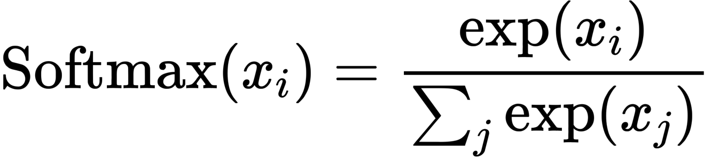

​				之后通过Categorical()函数构造概率分布，通过sample()函数进行动作采样。

```python
def action_select(state,network):
    state = torch.from_numpy(state).float()
    out = network(state)#从策略网络中输出动作概率
    probs = torch.softmax(out,dim=0)
    m = Categorical(probs)#构造动作概率
    action = m.sample()#采样一个动作
    return action.item()
```

2. 对于连续动作空间，我们不直接计算每个动作的概率，而是学习动作的概率分布，例如根据正态分布选择动作,正态分布的概率密度函数可以写为：

   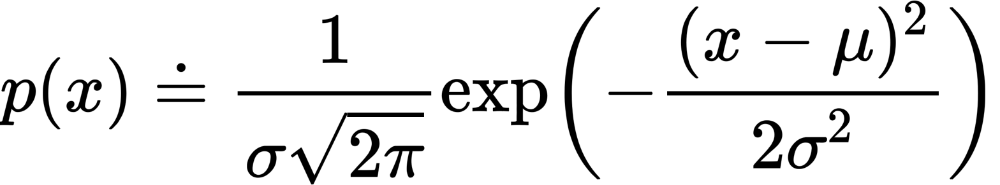

   $\mu$和$\sigma$是我们需要的两个参数，因此完全可以使用网络来近似这两个参数，然后构造成正态分布的形式，然后再采样一个动作，此时的策略网络这样写：

```python
class Policy(nn.Module):
    def __init__(self):
        super(Policy, self).__init__()
        self.state_space = state_space
        self.affine1 = nn.Linear(self.state_space, 128)
        self.dropout = nn.Dropout(p=0.6)
        self.affine2 = nn.Linear(128, 2)

    def forward(self, x):
        x = self.affine1(x)
        x = self.dropout(x)
        x = self.affine2(x)
        mu = 2 * F.tanh(x[0])
        sigma = F.softplus(x[1])
        return mu,sigma
```

​				其中softpuls操作保证了标准差$\sigma$为正数，$\mu$的范围根据实际动作空间取值来定。	

```python
#定义一个动作选择方法:输入一个动作输出动作的概率并采样一个动作
def action_select(state,network):
    state = torch.from_numpy(state).float()
    mu,sigma = network(state)#从策略网络中输出动作概率
    m = normal.Normal(mu,sigma)
    action = m.sample()#采样一个动作
    return action,m
```

到此为止，REINFORCE算法完成。

### REINFORCE with Baseline

带有基线的REINFORCE算法可以有效降低方差，也加快了学习速度，基线应该根据状态的变化而变化，在一些状态下，所以动作的价值可能都比较大，因此我们需要一个较大的基线用于区分拥有更大值的动作和相对值不那么高的动作，其他状态下当所有动作的值都比较低时，基线也应该较低。

经过证明得到带有Baseline的更新公式：

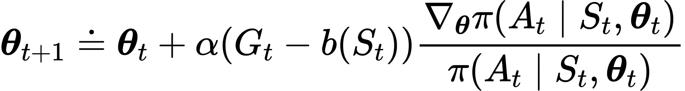

在累计回报中减去这个基线不会使更新值的期望发生变化。在实现中，我们可以使用另外一个神经网络近似的值函数来作为基线，在代码上体现在计算累计收益上：

```python
    running_add = 0
    for t in reversed(range(step)):#反向计算每一次的期望收益，用采样值代替
        running_add = running_add * discount_factor + reward_pool[t]
        update_network(running_add,state_pool[t],value_prediction)
        reward_pool[t] = running_add - value_estimator(state_pool[t],value_prediction).item()
        #value_estimator是另外一个神经网络，用来近似状态价值函数，作为基线。这个网络的学习率需要精心设计。
```

## Actor Critic 

REINFORCE算法是利用一幕中采样到的数据进行更新的，这样虽然是无偏的，但是方差高，使用自举的方法可以在每一步或几步后就做出策略改进，这样做引入了偏差但减小了方差，很多算法都是基于Actor_Critic架构的。

Actor_Critic的核心思想就是将PG和值函数逼近法相结合，同时学习策略和值函数，实现实时在线地学习。

AC算法的流程可以表述为：

1. Agent根据任务的当前状态选择一个动作（基于当前策略）；
2. 评论家根据当前状态-动作对，针对策略的表现打分；
3. 行动家依据评论家的打分，改进策略；
4. 评论家根据环境返回的reward，改进打分策略；
5. 利用更新后的策略在下一状态选择动作，重复以上过程。

### 优势函数（advantage function）

AC算法里的优势函数类似于PG算法里的累计回报，Actor的目标是最大化优势函数，根据基线的思想，将状态$s$的价值$v_\pi(s)$作为基线$b(s)$，定义优势函数$A_{\pi_\theta}$：

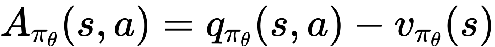

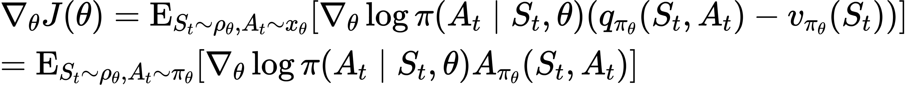

利用优势函数可以减小策略梯度的方差，一般采样TD误差代替$q_{\pi_\theta}(s,a)$:


于是目标函数变为：

### 实现

伪代码如下：


网络更新部分代码：

```python
def leaning(self,state,next_state,done,reward,log_prob):
  next_state = torch.FloatTensor(next_state)
  state = torch.FloatTensor(state)
  td_target = reward + (args.gamma * self.critic(next_state) * (1-done)).detach()
  value = self.critic(state)
  td_error = td_target - value.detach() #优势函数

  critic_loss = self.loss(td_target, value) #评论家损失函数
  writer.add_scalar('Loss/critic_loss', critic_loss, global_step=self.num_training)
  actor_loss = -(log_prob * td_error)   #同REINFORCE
  writer.add_scalar('Loss/actor_loss', actor_loss, global_step=self.num_training)

  self.actor_optimizer.zero_grad()
  actor_loss.backward()
  self.actor_optimizer.step()

  self.critic_optimizer.zero_grad()
  critic_loss.backward()
  self.critic_optimizer.step()

  self.num_training += 1
```

## Deep Deterministic Policy Gradient (DDPG)

DDPG（深度确定性策略梯度算法）一般用于连续动作的强化学习任务中，该算法基于深度神经网络表达确定性策略$\mu(s)$，采用确定性策略梯度来更新网络参数。 确定性策略与随机策略相比，策略网络输出的动作是固定的，不需要采样操作，为了实现Exploration 和 Exploitation的tradeoff，加入随机噪声影响动作的选择，一般为高斯噪声。

DDPG主要有三点改进方法：

1. 采用深度神经网络：构建基于深度神经网络的策略网络和价值网络，并用随机梯度下降训练网络。

2. 引入经验回放机制：Agent与环境产生的交互信息（状态，动作，下一个状态，回报）存储在经验池中，通过引入经验回放机制，减少值函数估计所产生的误差，解决数据间相关性及非静态分布问题，使算法收敛加速。

3. 采用双网络架构，策略函数和价值函数均使用双网络架构，使肃反啊的学习过程更加稳定快速。

   

Critic网络和AC算法相似，只不过输入为（状态+动作），输出为Q值。Actor网络与动作选择稍微又有些变化，Actor网络输入的是状态向量，输出的是一个动作

```python
class Actor(nn.Module):#行动家网络
    def __init__(self, state_dim, action_dim, max_action):
        super(Actor, self).__init__()

        self.l1 = nn.Linear(state_dim, 400)
        self.l2 = nn.Linear(400, 300)
        self.l3 = nn.Linear(300, action_dim)

        self.max_action = max_action

    def forward(self, x):
        x = F.relu(self.l1(x))
        x = F.relu(self.l2(x))
        x = self.max_action * torch.tanh(self.l3(x))#最大动作，tanh输出在[-1,1]之间
        return x
```

注意在动作的选择上使用的是预测Actor网络。

```python
def select_action(self, state):
    state = torch.FloatTensor(state.reshape(1, -1)).to(device)
    return self.actor(state).cpu().data.numpy().flatten()#用预测网络更新的动作
```

在训练的时候，与环境交互时加入高斯噪声影响动作的选择：

```python
action = agent.select_action(state)#探索动作输入
action = (action + np.random.normal(0, args.exploration_noise, size=env.action_space.shape[0])).clip(
                    env.action_space.low, env.action_space.high)#剪切最大最小动作输入
```

### 经验回放

在交互中的每一步状态转移都记录在经验池中，在训练过程中，每一幕完成后，从经验池中选取一定的batch size利用小批量梯度上升方法更新网络参数。经验池有一定的容量，类似于FIFO的操作。

```python
class Replay_buffer():
    '''
    Code based on:
  https://github.com/openai/baselines/blob/master/baselines/deepq/replay_buffer.py
    Expects tuples of (state, next_state, action, reward, done)
    '''
    def __init__(self, max_size=args.capacity):#经验回放池最大容量
        self.storage = []
        self.max_size = max_size
        self.ptr = 0

    def push(self, data):#压入经验回放池
        if len(self.storage) == self.max_size:#如果经验池满了，把最开始的经验挤掉
            self.storage[int(self.ptr)] = data
            self.ptr = (self.ptr + 1) % self.max_size
        else:
            self.storage.append(data)

    def sample(self, batch_size):#采样batch_size个轨迹
        ind = np.random.randint(0, len(self.storage), size=batch_size)#在整个经验池里随机采样
        x, y, u, r, d = [], [], [], [], []

        for i in ind:
            X, Y, U, R, D = self.storage[i]
            x.append(np.array(X, copy=False))#state
            y.append(np.array(Y, copy=False))#next_action
            u.append(np.array(U, copy=False))#action
            r.append(np.array(R, copy=False))#reward
            d.append(np.array(D, copy=False))#done

        return np.array(x), np.array(y), np.array(u), np.array(r).reshape(-1, 1), np.array(d).reshape(-1, 1)
```

### 软更新操作

由于DDPG有目标网络和预测网络两套网络，在更新过程中是通过MBGD更新的预测网络，然后采用软更新的方法，目标网络参数会在一定程度上靠近预测网络。

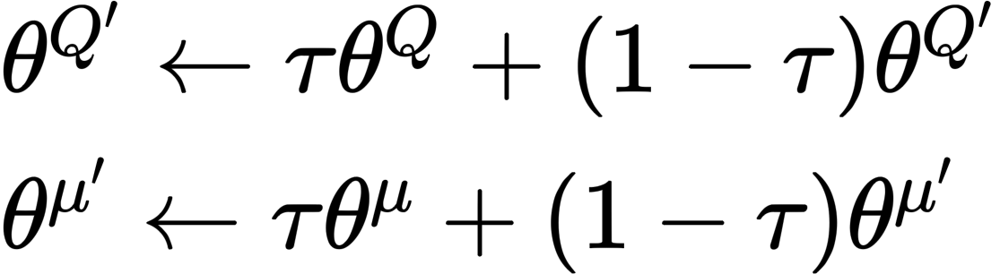

采用软更新方法，目标值会一直缓慢的向当前估算值靠近，既保证了网络参数的及时更新，又保证了训练时间预测网络梯度的相对稳定，使算法更容易收敛。其缺点是每次更新参数变化很小，学习时间过长。

### 实现


算法执行流程：

1. 初始化Actor($Q(s,a|\theta^Q)$)和Critic($\mu(s|\theta^\mu)$的网络，称为预测网络，copy初始化的网络给target Actor($Q^\prime$)和Critic($\mu^\prime$)的网络，称为目标网络；

2. 初始化经验池；

3. 在每一幕中：

   1. 用预测actor网络选取动作，加入高斯噪声影响动作选择；

   2. 将每一步的交互数据（状态，下一个状态，动作，收益，是否完成一幕）记录在经验池中；

   3. 重复以上过程完成一幕。

   4. 更新N次网络参数：

      1. 从经验池中随机采样小批量的n个经验转移样本，用critic目标网络计算目标值：$y_{i}=r_{i}+\gamma Q^{\prime}\left(s_{i+1}, \mu^{\prime}\left(s_{i+1} \mid \theta^{\mu^{\prime}}\right) \mid \theta^{Q^{\prime}}\right)$

         ```python
         target_Q = self.critic_target(next_state, self.actor_target(next_state))#这里的target_Q是用目标网络更新的
         target_Q = reward + (done * args.gamma * target_Q).detach()#最后一幕收益为0 detach分离向量不计算梯度
         ```

      2. 用ctiric预测网络计算当前的q值

         `current_Q = self.critic(state, action)#计算预测评论家网络q值`

      3. 使用MBGD，根据最小化损失函数来更新预测critic网络$L=\frac{1}{N} \sum_{i}\left(y_{i}-Q\left(s_{i}, a_{i} \mid \theta^{Q}\right)\right)^{2}$；

         ` critic_loss = F.mse_loss(current_Q, target_Q)`

      4. 使用MBGA，根据最大化目标函数来更新actor预测网络（注意代码上要加负号）$\left.\left.\nabla_{\theta^{\mu}} J \approx \frac{1}{N} \sum_{i} \nabla_{a} Q\left(s, a \mid \theta^{Q}\right)\right|_{s=s_{i}, a=\mu\left(s_{i}\right)} \nabla_{\theta^{\mu}} \mu\left(s \mid \theta^{\mu}\right)\right|_{s_{i}}$；

         `actor_loss = -self.critic(state, self.actor(state)).mean()`

      5. 软更新目标网络的参数：


[## TD3 （双延迟-确定性策略梯度）](https://blog.csdn.net/weixin_45492196/article/details/107866309)

TD3算法是一个对DDPG优化的版本，即TD3也是一种基于AC架构的面向连续动作空间的DRL算法，主要包括三个非常主要的优化。

### Double Network

DDPG源于DQN，是DQN解决连续控制问题的一种方法。然而**DQN存在过估计问题**

在TD3中，使用 **两套网络(Twin)** 表示不同的Q值，通过选取**最小**的那个作为我们更新的目标（Target Q Value），抑制持续地过高估计。 ——TD3的基本思路

> 1. 什么是过估计？
>
>    过估计是指估计的值函数比真实的值函数大。
>
> 2. 为什么DQN存在过估计的问题?
>
>    因为DQN是一种off-policy的方法，每次学习时，不是使用下一次交互的真实动作，而是使用当前认为价值最大的动作来更新目标值函数，所以会出现对Q值的过高估计。通过基于函数逼近方法的值函数更新公式可以看出：
>
>    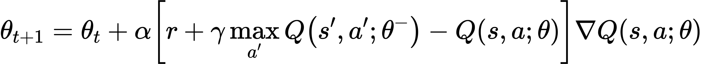
>
> 3. 怎么解决这个问题？
>
>    所谓的Double Q Learning是将**动作的选择**和**动作的评估**分别用不同的值函数来实现。

### 延迟更新Actor网络

> 想象一下，原本是最高点，当Actor好不容易到达最高点，Q值更新了，这里并不是最高点了。这是Actor只能转头再继续寻找新的最高点；更坏的情况是Actor被困在次高点，没能找到正确的最高点。
>
> - 如果Q能稳定下来再学习policy，应该就会减少一些错误的更新；所以，我们可以把Critic的更新频率，调的比Actor要高一点。让critic更加确定，actor再行动。

### 实现

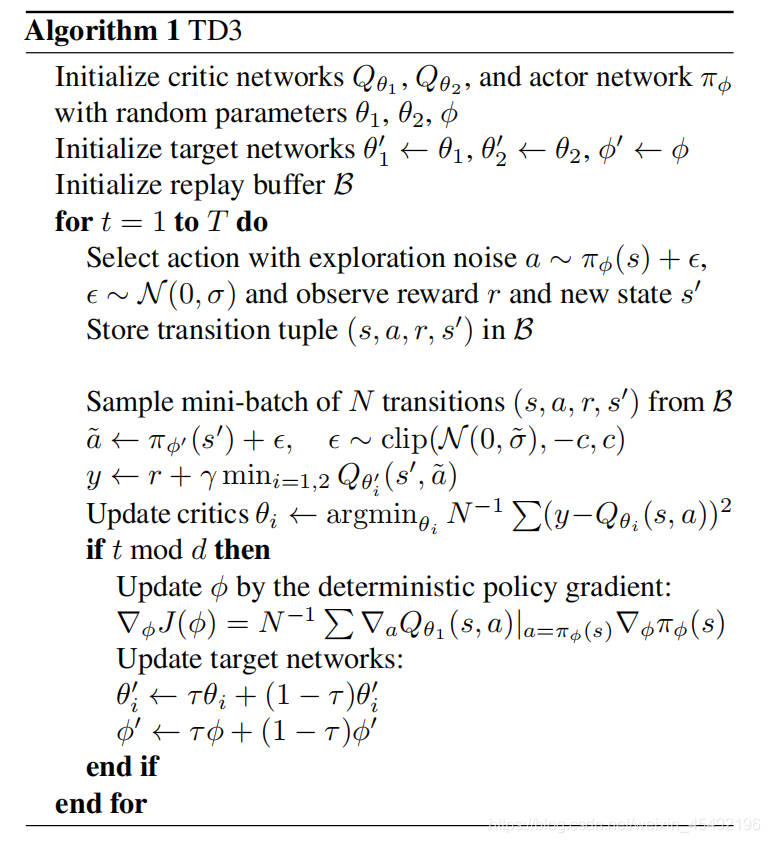

算法执行流程：

1. 初始化双评论家网络$Q_{\theta_1},Q_{\theta_2}$，和行动家网络$\pi_\phi$

2. 复制以上三个网络称为目标网络$Q_{\theta_1^\prime},Q_{\theta_2^\prime},\pi_{\phi^\prime}$

3. 初始化经验池

4. 在每一幕中：

   1. 用预测actor网络选取动作，加入高斯噪声影响动作选择；

      ```python
      action = agent.select_action(state)                                                             #这里的action是通过行动家网络的出来的
      action = action + np.random.normal(0, args.exploration_noise, size=env.action_space.shape[0])   #添加高斯噪声
      action = action.clip(env.action_space.low, env.action_space.high)                               #截断动作区间 
      ```

   2. 将一步的交互数据保存到经验池中；

   3. （可以多次循环）从经验池中采样mini-batch个状态转移数据（状态，动作，回报，下一个状态）；

      1. 根据目标行动家网络对batch中每一步数据构造下一个动作：

         注意行动家使用的是目标actor网络，添加高斯噪声，最后上下截断输出动作。**这里伪代码中截断的是噪声**：

          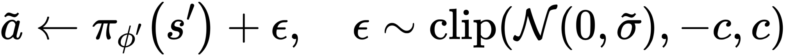

         ```python
         #Select next action according to target policy:
         noise = torch.ones_like(action).data.normal_(0, args.policy_noise).to(device) #构造action的噪声
         noise = noise.clamp(-args.noise_clip, args.noise_clip)              #根据上下限截断noise
         next_action = (self.actor_target(next_state) + noise)               #下一次行动就等于目标行动家网络输出的动作+噪声动作
         next_action = next_action.clamp(-self.max_action, self.max_action)  #根据动作输出上下限截断动作
         ```

      2.  根据上一步得到的下一个动作和经验池中的下一个状态，通过双Critic目标网络预测Q值，取这两个结果中的最小值，再计算TD-target：

         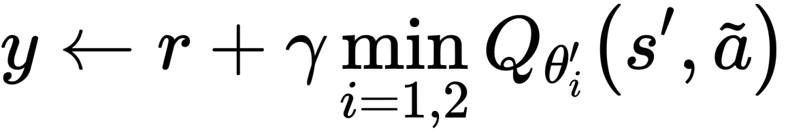

         ```python
         target_Q1 = self.critic_1_target(next_state, next_action)           #通过目标评论家1网络计算q值
         target_Q2 = self.critic_2_target(next_state, next_action)           #通过目标评论家2网络计算q值
         target_Q = torch.min(target_Q1, target_Q2)                          #取最小的一个Q值
         target_Q = reward + ((1 - done) * args.gamma * target_Q).detach()   #计算target值
         ```

      3. 通过Critic网络计算当前状态的Q值，并更新Critic网络

         ```python
         current_Q1 = self.critic_1(state, action)
         current_Q2 = self.critic_2(state, action)
         loss_Q1 = F.mse_loss(current_Q1, target_Q)
         loss_Q2 = F.mse_loss(current_Q2, target_Q)
         self.critic_1_optimizer.zero_grad()
         self.critic_2_optimizer.zero_grad()
         loss_Q1.backward()
         loss_Q2.backward()
         self.critic_1_optimizer.step()
         self.critic_2_optimizer.step()
         ```

      4. 延迟更新策略，在一幕中每隔d步：

         1. 通过actor网络选择的下一个动作和当前状态，输入critic1网络得出Q值，进行梯度上升，更新actor策略

            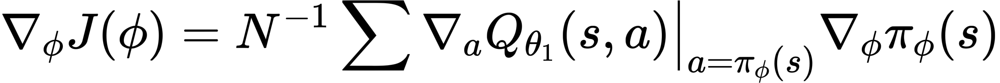

            ```python
            actor_loss = - self.critic_1(state, self.actor(state)).mean()   #论文伪代码确实是这样写的
            self.actor_optimizer.zero_grad()
            actor_loss.backward()
            self.actor_optimizer.step()
            ```

         2. 软更新3个目标网络

            

            ```python
            for param, target_param in zip(self.actor.parameters(), self.actor_target.parameters()):
            		target_param.data.copy_(((1- args.tau) * target_param.data) + args.tau * param.data)
            for param, target_param in zip(self.critic_1.parameters(), self.critic_1_target.parameters()):
            		target_param.data.copy_(((1 - args.tau) * target_param.data) + args.tau * param.data)
            for param, target_param in zip(self.critic_2.parameters(), self.critic_2_target.parameters()):
            		target_param.data.copy_(((1 - args.tau) * target_param.data) + args.tau * param.data
            
            ```

## PPO (proximal policy optimization)

